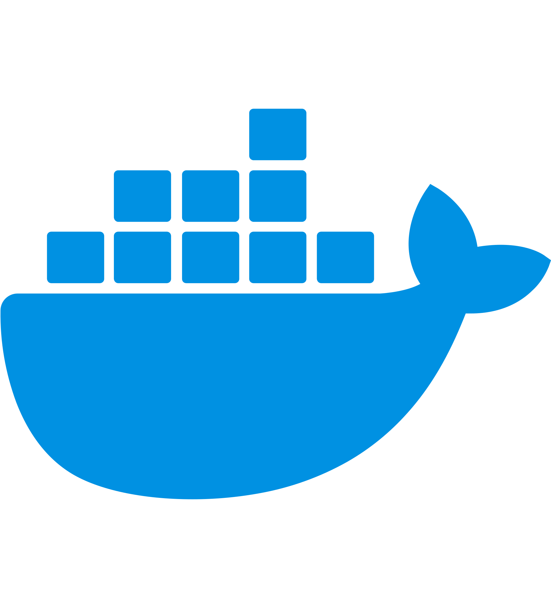
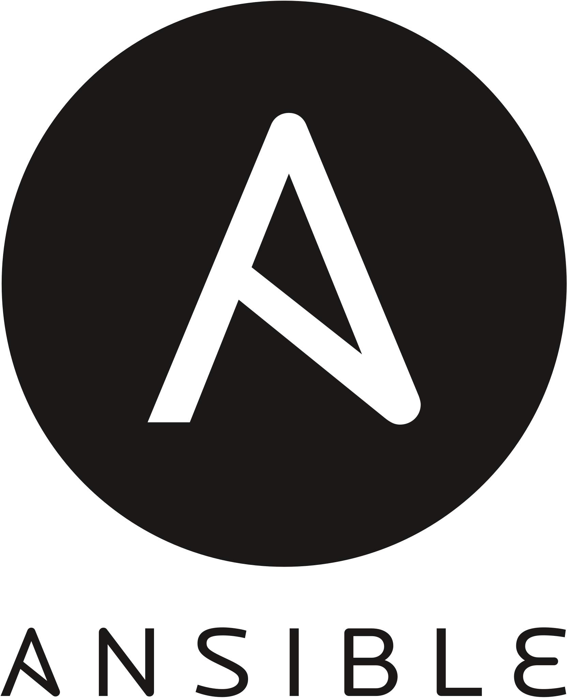
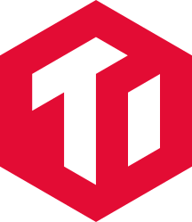
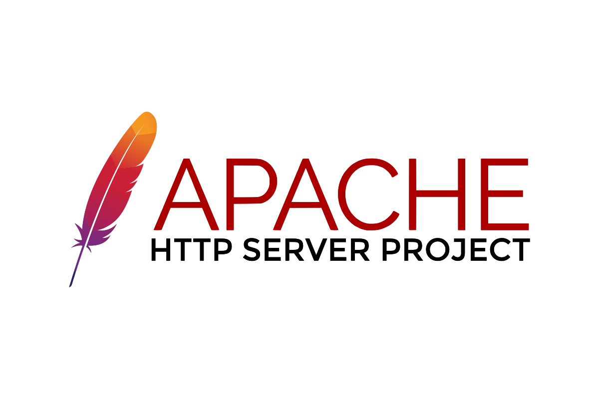
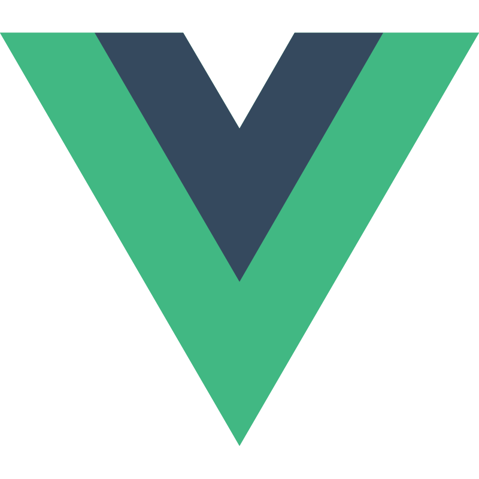

<section id="introduction">
    
 
    <h2 style="text-align:center;">Hi</h2>
    

      I'm a fullstack engineer now working on DevOps with distributed database, a variant of TiDB in my company.
    

    

        My daily job includes dealing with Kubernetes, Web Development using Vue, TypeScript, Golang.
    

    

</section>

<section id="techstack">
    
 
        <h2 style="text-align:center;">Tech Stack</h2>
        

                
ops stack:

                

                    
                    
                    
                    
                    
                    
                    
                    
                    
                    
                    
                    
                    
                    
                    
                    
                

            
backend stack:

            

                
                
                
                
                
                
                
                
                
                
                
                
            

            
AI stack:

            

                
                
                
            

            
frontend stack:

            

                
                
                
                
                
                
            

        

    

</section>

## 👷 Some stuffs I did, long time ago...
- [GeekerHWH/mirrorSpeedTest](https://github.com/GeekerHWH/mirrorSpeedTest) - Mirror Bandwith and Latency measurement
- [Wenhao Hu' Site](https://geekerhwh.pages.dev) - My personal website powered by Hugo Framwork, developed based on hugo-profile

### 📫 How to reach me:

Wechat Official Account(微信公众号) : 某某昊的日记本

Personal Website : https://geekerhwh.pages.dev (never maintain...)

Gmail : mailto:hacker.huwenhao@gmail.com

    

        
    

